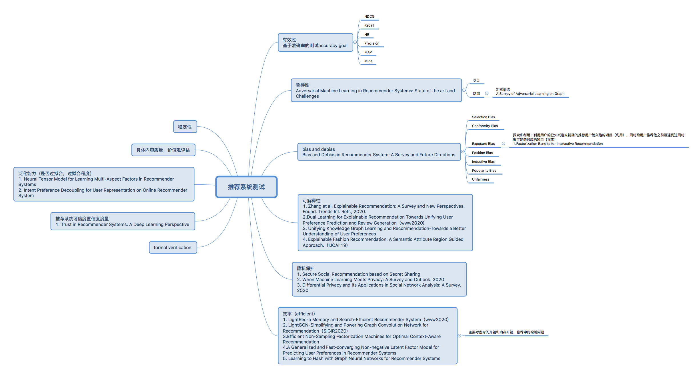

# 2021.02.08RecSys会议纪要

## 会议内容
- 分享论文
  - 李其宇：[MVL](https://dl.acm.org/doi/abs/10.1145/3397271.3401294?casa_token=nQFhGsufqqwAAAAA:roRY_ZTl8RZV4oZV4jMrhcJtdV8VLrnAOxMvxpAfvbNixEso_W8coyC-CkENvduzjjMdR6waObY)结合Content View 以及 Graph View两个方面分别表示user及news的特征
  - 张旭东：[FIM](https://www.aclweb.org/anthology/2020.acl-main.77/)
  - 吴卓： Controlling Fairness and Bias in Dynamic Learning-to-Rank
- 评估并筛选七类bias中对新闻推荐有意义的
## 讨论及建议
### 1.新闻推荐系统相关
- 从标题、内容、分类、用户浏览历史以外的角度考虑信息（如：单篇停留时间）
- 利用深度学习实现跨领域推荐。使用用户其他Domain的信息加强现有推荐
- 商业角度来说，推荐相同Domain的更好

- 系统展示DEMO可以从 新闻特征、用户特征以及bias的角度来展示
### 2.测试相关
- 评估指标造成的真正影响
- 推荐系统评价体系
    1. 大的颗粒度 需要考虑哪些性质 
    2. 指标定义 （定性）
    3. 量化指标 （定量） 
    4. 评测方法

3. 其他
    - [沈向阳：读论文的三个层次](https://baijiahao.baidu.com/s?id=1667931130327665175&wfr=spider&for=pc)
## 下一阶段工作重点：
- 李其宇、张旭东：
    1. 搭建新闻推荐系统展示DEMO
- 李其宇：
    1. 完善推荐系统指标文档
- 吴卓：
    1. 与雨宁讨论跨Domain API
    2. 研究七种bias的定性定量指标

