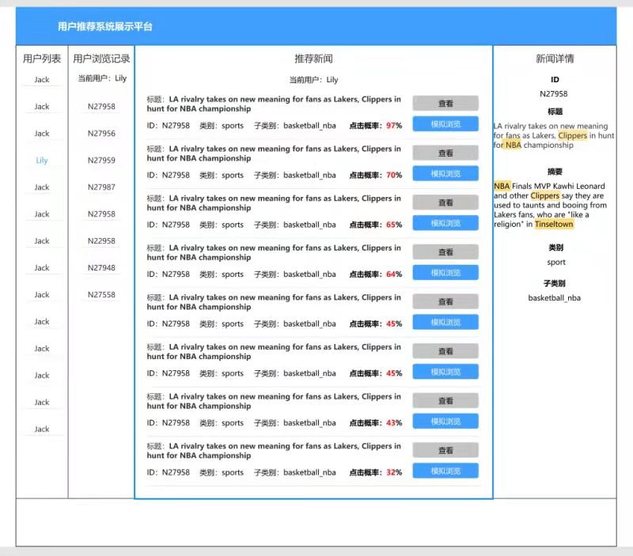

# 2021.02.18RecSys会议纪要

## 会议内容
- 分享论文
  - 张旭东、李其宇：介绍推荐系统模拟平台进度（初步完成API，初步绘制页面设计）
  - 吴卓：
    - 分享论文[ACL'20](https://arxiv.org/abs/2005.04118)，介绍推荐系统多种测试方法（最小功能测试、不变性测试、最小期望测试）以及如何生成测试用例
    - 分享推荐系统测试的评测方法及评测指标
## 讨论及建议
### 1.新闻推荐系统模拟平台
- 页面需要突出模型的输出以及针对模型的评测结果
- 模型是否为Online（初步定为只展示推理过程）
- 测试API的run time，如果时间较长则更新具体方案

### 2.测试相关
- 考虑测试的多样性及个性化
- 考虑几个指标之间的关系，后续可以归并指标，survey可以写四到五章
- 考虑其他推荐系统评测指标是否可以使用在新闻推荐中（比如：人的烦躁程度，人的行为，人的心理）[WWW'16](https://dl.acm.org/doi/abs/10.1145/2872427.2874813)，区分一般推荐系统评测和新闻推荐系统评测，发现新闻推荐系统评测中独特的部分
- 多样性如何考虑语义
- 是否能够推荐用户想看的，推荐用户该看的；度量真实算法和推荐逻辑的偏差（输出端如何体现需要考虑的因素）
- 逻辑清晰时：测试生成、测试停止条件；逻辑不清晰时：蜕变测试

### 3. 推荐系统投毒（输入数据扰动）
- 给用户添加fake news、修改新闻的类别等信息，可以考虑用强化学习的方法
- 现阶段添加用户的fake news可行性较高，
- 投毒（输入数据扰动）可考虑有目标的和无目标的，有目标的可以是降低某一新闻的排序，无目标的是使得整体排名变换
## 下一阶段工作重点：
- 李其宇：
    1. 2月21日前完成新版页面设计
- 李其宇、张旭东：
    1. 2月28日前完成一期系统上线
    2. 调研推荐系统投毒方式及state of art的论文

- 吴卓：
    1. 扩充推荐系统测试survey第二层，定性指标

